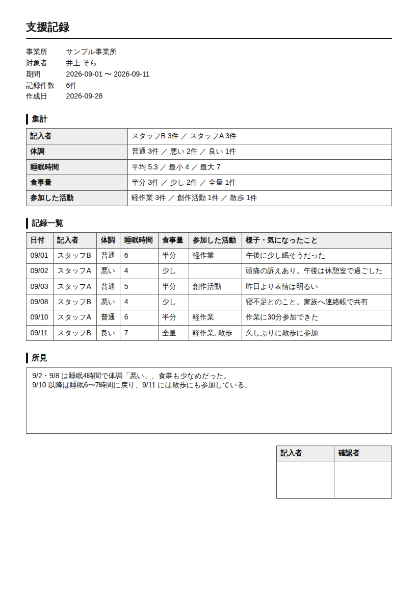

# フォーム回答 → 帳票MCP（form-report）

Google フォームの回答から、個人別の記録（支援記録など）や全員分の集計レポートを作る MCP サーバーです。
「フォームで集めた回答を印刷して、手で書き写す」作業をなくすデモとして作りました（福祉事業所・教室・サロンなど）。

Claude が回答を読んで**所見の下書き**を作り、人が確認してから、印刷用 HTML（A4）と Excel 用 CSV に出力します。



出力例: [examples/支援記録_サンプル.html](examples/支援記録_サンプル.html)（架空データ。ブラウザで開いて印刷 →「PDF に保存」で PDF にもなります）

## ツール

| ツール | 内容 |
|---|---|
| `describe_form` | 質問一覧と種類（数値 / 選択肢 / 自由記述）、回答件数、期間 |
| `list_people` | 対象者ごとの回答件数と最終回答日 |
| `get_responses` | 対象者・期間で絞った回答 |
| `summarize` | 数値は平均・最小・最大、選択肢は件数（チェックボックスの複数回答は分けて数える）、自由記述は日付付き一覧 |
| `create_report` | 印刷用 HTML の帳票を保存。対象者を省略すると全員分の集計レポート |
| `export_csv` | Excel で文字化けせずに開ける CSV（BOM 付き UTF-8）を保存 |

プロンプト: `monthly_record`（対象者と期間を指定 → 回答を読む → 所見の下書き → 確認 → 帳票を保存）

所見は回答に書かれた事実だけから作るよう指示しています。診断や推測は書かせません。

## デモの流れ（Claude Code で話しかける例）

1. 「フォームにどんな質問があるか見せて」→ `describe_form`
2. 「井上さんの9月の様子をまとめて」→ `summarize` / `get_responses`
3. 「所見を下書きして」→ Claude が下書き → 人が直す
4. 「支援記録として保存して」→ `create_report` → ブラウザで開いて印刷
5. 「全員分を Excel で」→ `export_csv`

## 動かし方

### 1. サンプルモード（認証なしですぐ試す）

架空の福祉事業所の日次記録（`sample_responses.json`、利用者3人・2週間分）で動きます。

```bash
pip install -r mcp/form_report/requirements.txt
claude mcp add form-report -e FORM_ORGANIZATION=サンプル事業所 -- python mcp/form_report/server.py
```

帳票は作業ディレクトリの `reports/` に保存されます（`.gitignore` 済み）。

### 2. 本番モード（実際のフォームにつなぐ）

1. Google フォームの「回答」タブ →「スプレッドシートにリンク」で回答シートを作る
2. Google Cloud でサービスアカウントを作り、JSON キーをダウンロードする（Google Sheets API を有効化）
3. 回答シートの「共有」で、サービスアカウントのメールアドレスを **閲覧者** として追加する（読むだけなので閲覧者で十分）
4. 環境変数を付けて登録する

```bash
claude mcp add form-report \
  -e FORM_SHEET_ID=<回答シートURLの /d/ と /edit の間> \
  -e GOOGLE_APPLICATION_CREDENTIALS=/path/to/service-account.json \
  -e FORM_ORGANIZATION=<帳票に載せる事業所名> \
  -- python mcp/form_report/server.py
```

| 環境変数 | 内容 | 省略時 |
|---|---|---|
| `FORM_SHEET_ID` | 回答スプレッドシートの ID | サンプルモード |
| `GOOGLE_APPLICATION_CREDENTIALS` | サービスアカウントの JSON キーのパス | サンプルモード |
| `FORM_WORKSHEET` | 回答が入っているタブ名 | 最初のタブ |
| `FORM_PERSON_COLUMN` | 対象者の名前が入る質問文 | 「利用者名」「氏名」「お名前」「名前」「生徒名」から自動で探す |
| `FORM_ORGANIZATION` | 帳票に載せる事業所名 | 表示しない |
| `FORM_REPORT_DIR` | 帳票の保存先 | `reports/` |

個人情報を扱うので、帳票の保存先はリポジトリの外か `reports/`（コミットされない）にしてください。

## テスト

```bash
pip install pytest
python -m pytest mcp/form_report/test_server.py
```

`mcp/` 配下の各サーバーはモジュール名（`server` / `store`）が同じなので、テストはサーバーごとに分けて実行してください。

## 前提と制限

- 1行目が質問文、1列目が「タイムスタンプ」という Google フォーム標準の回答シート形式
- 質問の種類は、全回答の中身から判定する（全部数値なら数値、選択肢が8種類以下で繰り返し出てくるなら選択肢）
- PDF はブラウザの印刷機能で作る想定（日本語フォントを同梱しないため）
