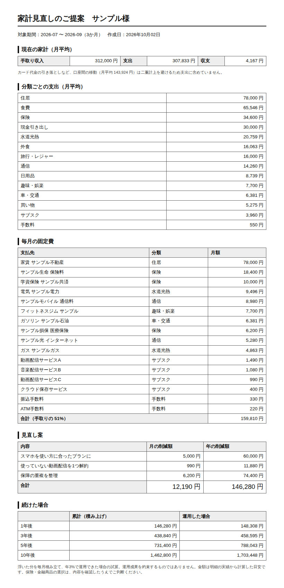

# 家計見直しMCP（household-review）

銀行・カードの明細から支出を分類し、**固定費・見直しの候補・削減のシミュレーション**を出して、相談者に渡せる報告書まで作る MCP サーバーです。
FP（ファイナンシャルプランナー）が家計の見直し相談をするときの下準備を引き受けるデモとして作りました。



出力例: [examples/家計見直し_サンプル.html](examples/家計見直し_サンプル.html)（架空の家庭の明細3か月分）

> 明細の読み込み・分類・集計・試算までを行い、**特定の保険・金融商品やプランを勧めることはしません**。見直しの提案は FP が行う前提です。

## ツール

| ツール | 内容 |
|---|---|
| `overview` | 対象期間・取引数・月平均の収入と支出と収支・未分類の数 |
| `import_statement` | 明細 CSV を取り込む（同じ取引は二重に入らない） |
| `add_transactions` | PDF・紙・画面の明細を Claude が読み取った取引を追加 |
| `uncategorized` | 分類できなかった取引（摘要ごとの件数と金額） |
| `set_category` | 「この言葉を含む取引はこの分類」というルールを追加して分類し直す |
| `monthly_summary` | 月ごと・分類ごとの支出と収入、月平均 |
| `fixed_costs` | 毎月続いている支払い（2か月以上・金額のばらつき±15%以内）と、手取りに占める割合 |
| `review_points` | 見直しの候補（サブスク・手数料・通信・保険・現金引き出し・外食）と、根拠の数字・面談で聞くこと |
| `simulate` | 見直し案ごとの月額・年額・累計。運用を仮定する場合は利回りを前提として明記 |
| `render_report` | A4 の報告書（HTML） |

プロンプト: `review_session`（分類の確認 → 支出と固定費 → 見直し候補と聞くこと → 合意した案で試算 → 報告書）

## 二重計上を防ぐ

銀行とカードの両方の明細を読み込むと、銀行側の「カード代金の引き落とし」とカード側の明細が同じお金を二重に数えてしまいます。
引き落としや自分の口座どうしの移動は「振替（集計外）」に分類して支出から除き、報告書にもその旨と金額を書きます。
既定のルールで拾えない書き方の場合は、`set_category("○○カード", "振替（集計外）")` のように登録してください。

## 明細の形式

| 種類 | よくある列 | 扱い |
|---|---|---|
| 銀行 | 日付・摘要・お引出し・お預入れ | 引出し＝支出、預入れ＝収入 |
| カード | 利用日・利用店名・利用金額 | プラスは支出、マイナスは返金 |

列名のゆれ（取引日・ご利用日、内容・ご利用店名、出金・入金 など）、「2,980円」のような金額、「2026年09月03日」のような日付、Shift_JIS に対応しています。

## デモの流れ（Claude Code で話しかける例）

架空の家庭（`sample/` の銀行とカードの明細3か月分）で試せます。

1. 「この家計の状況は？」→ 手取り月31.2万円に対して支出30.8万円、収支は月4,167円
2. 「固定費と見直しの候補は？」→ 固定費は手取りの51%。サブスク・会費が月11,660円、保険料が手取りの11%、使い道の見えない現金引き出しが月3万円
3. 「スマホ月5,000円、動画配信1つ解約、保障の重複整理で月6,200円下げたら？」→ 月12,190円・年146,280円、10年で146万円（年3%で運用できた場合は約170万円）
4. 「報告書にして」→ A4 の報告書

## 動かし方

```bash
pip install -r mcp/household_review/requirements.txt

# サンプルで試す
claude mcp add household-review -- python mcp/household_review/server.py

# 相談者ごとにファイルを分けて使う（明細・分類ルールを保存。リポジトリの外に置く）
claude mcp add household-review -e HOUSEHOLD_DATA_PATH=/path/to/相談者A.json -- python mcp/household_review/server.py
```

| 環境変数 | 内容 | 省略時 |
|---|---|---|
| `HOUSEHOLD_DATA_PATH` | 明細と分類ルールを保存するファイル（相談者ごとに1つ） | サンプルの明細をメモリ上で使う |
| `HOUSEHOLD_EXPORT_DIR` | 報告書の保存先 | `reports/` |

明細は相談者の大切な個人情報です。保存ファイルと報告書は FP の手元（暗号化されたドライブなど）に置き、共有フォルダやリポジトリには置かないでください。

## テスト

```bash
pip install pytest
python -m pytest mcp/household_review/test_server.py
```

`mcp/` 配下の各サーバーはモジュール名（`server` など）が同じなので、テストはサーバーごとに分けて実行してください。

## 制限

- 分類は摘要の言葉で決めるので、店名から分からないもの（ネット通販の中身など）は大まかになる
- 2か月ごとの請求（水道など）は金額がそろわないため固定費に入らない（分類ごとの月平均には入る）
- 年払い・半年払いの支払い（保険・自動車税など）は、明細の期間に入っていないと見えない。面談で聞く
