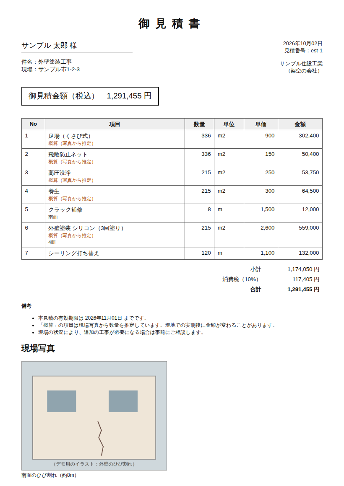

# 写真 → 見積MCP（photo-estimate）

現場写真とメモから、単価表を当てて**見積書のたたき台**を作る MCP サーバーです。
「見積書を現場から帰ってから夜に作っている」外壁・リフォーム・設備の職人さん向けのデモとして作りました。



出力例: [examples/見積書_サンプル.html](examples/見積書_サンプル.html)（架空の会社・お客さま・単価。写真はデモ用のイラスト。ブラウザで印刷 →「PDF に保存」で PDF にもなります）

## 役割分担

- **Claude** : 写真を見て、必要そうな工事項目と数量の見当をつける。見えないこと（裏側・内部の配管など）は推測せずに聞く
- **このサーバー** : 単価表・面積の目安・組みになる工事の抜けのチェック・金額の計算・A4 の見積書
- **職人さん** : 数量の確定（実測）と、金額の最終判断

数量には根拠（**実測 / 図面 / 写真から推定**）を必ず付けます。写真から推定した項目は見積書に「概算（写真から推定）」と表示し、備考に「実測後に金額が変わることがある」と書きます。

## ツール

| ツール | 内容 |
|---|---|
| `price_list` | 単価表（区分で絞り込み） |
| `calc_wall_area` | 外周・高さ・開口部から、塗装面積と足場面積の目安 |
| `create_estimate` | 見積を作る（お客さま・現場・件名・諸経費の率） |
| `add_items` | 工事項目を追加。単価表のコードか、単価表に無い項目（名前・単位・単価）。数量の根拠付き |
| `remove_item` | 項目を削除 |
| `attach_photos` | 現場写真を付ける（JPEG / PNG、見積書の末尾に載る） |
| `review_estimate` | 明細・小計・諸経費・消費税・合計と、確認すべき点（warnings） |
| `render_estimate` | A4 の見積書（HTML）を保存 |

プロンプト: `estimate_from_photos`（写真から工事項目と根拠 → 面積の目安 → 見積 → 写真 → チェックを確認 → 見積書）

## 面積の目安と抜けのチェック

- 塗装面積 = 外周 × 高さ − 開口部（窓・ドア）
- 足場面積 = (外周 + 8m) × (高さ + 1m)（建物から足場までの離れと、上端の手すり分を見込む目安）

`review_estimate` が出す warnings:

- 組みになる工事の抜け：塗装なのに高圧洗浄・養生・足場が無い、足場なのに飛散防止ネットが無い、給湯器交換なのに撤去・処分が無い
- 写真から推定した数量がある（実測してから確定するよう促す）
- 足場の面積が外壁塗装の面積より小さい（通常は足場のほうが大きい）

## 金額の計算

- 明細の金額 = 数量 × 単価（1円未満は四捨五入。数量は小数も可）
- 諸経費 = 小計 × 率（1円未満は切り捨て。単価表の項目で計上するなら率は 0）
- 消費税 = (小計 + 諸経費) × 10%（1円未満は切り捨て）

## 単価表

`sample_price_list.csv` は**架空の単価**で、相場ではありません。自分の単価表を CSV（コード,区分,項目,単位,単価,備考）で用意して使ってください。Excel で保存した Shift_JIS も、「2,600」のようなカンマ付きの単価も読めます。

組みになる工事のチェックは単価表のコードで判定しています（`pricing.py` の `PAIRING_RULES`）。自分の単価表でコードを変えた場合は、ここも合わせてください。

## 動かし方

```bash
pip install -r mcp/photo_estimate/requirements.txt

# サンプルの単価表で試す（見積はメモリ上だけ）
claude mcp add photo-estimate -- python mcp/photo_estimate/server.py

# 自分の単価表と会社名で使う（見積はファイルに保存）
claude mcp add photo-estimate \
  -e PRICE_LIST_CSV=/path/to/単価表.csv \
  -e ESTIMATE_DATA_PATH=/path/to/estimates.json \
  -e "ESTIMATE_COMPANY=○○工業
岡山県○○市…
TEL 000-0000-0000" \
  -- python mcp/photo_estimate/server.py
```

| 環境変数 | 内容 | 省略時 |
|---|---|---|
| `PRICE_LIST_CSV` | 単価表の CSV | 架空の単価表 |
| `ESTIMATE_DATA_PATH` | 見積を保存するファイル | メモリ上だけ |
| `ESTIMATE_COMPANY` | 見積書に載せる会社名・住所・連絡先（改行区切り） | 架空の会社名 |
| `ESTIMATE_EXPORT_DIR` | 見積書の保存先 | `reports/` |

## テスト

```bash
pip install pytest
python -m pytest mcp/photo_estimate/test_server.py
```

`mcp/` 配下の各サーバーはモジュール名（`server` など）が同じなので、テストはサーバーごとに分けて実行してください。

## 制限

- 写真だけでは正確な寸法は分からない。写真からの数量は「概算」で、確定には実測か図面が必要
- 屋根の面積（勾配）、内装、設備の配管ルートなどの計算は未対応（数量を直接入れる）
- 見積書の書式は1種類。会社ごとの書式に合わせるには `server.py` の HTML を直す
