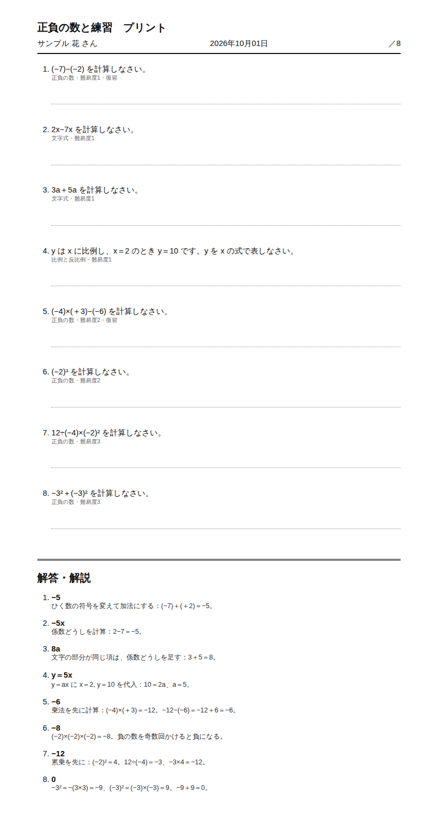

# 問題バンクMCP（problem-bank）

問題を**溜め**、先生が**確認**し、生徒ごとの**苦手と復習**に合わせて**プリント**を作る MCP サーバーです。
「Claude に毎回チャットで問題を作ってもらっている」家庭教師・塾が、「放っておいても問題が溜まり、生徒ごとに出し分けられる」状態に進むためのデモとして作りました。



出力例: [examples/プリント_サンプル.html](examples/プリント_サンプル.html)（架空の生徒。印刷すると解答・解説は別ページになります）

## 役割分担

- **Claude** : 足りない単元・難易度の問題を作る（答えを別の方法で解き直して確かめてから入れる）。下書きを解き直して先生の確認を手伝う
- **このサーバー** : 問題の保存、確認の管理、単元ごとの充足、生徒の記録、出題の選び方、プリントづくり
- **先生** : 問題と答えが正しいかの最終確認（確認済みにした問題だけがプリントに出る）

AI が作った問題は**答えを間違えることがあります**。サンプルにも、答えが間違った下書き（2x＋3＝11 の答えが「x＝7」）をわざと1問入れてあり、`check_drafts` の流れで見つけて直すところまでをデモにできます。

## ツール

| ツール | 内容 |
|---|---|
| `coverage` | 単元×難易度（1〜3）ごとの確認済み・下書きの数と、目標に足りないところ（gaps） |
| `add_problems` | 問題を追加。AI生成は下書き、自作は確認済み。問題文が同じものは二重に入らない |
| `review_queue` | 確認待ちの下書き |
| `approve` / `reject` / `edit_problem` | 確認・却下（理由を記録）・修正（確認済みを直したら下書きに戻る） |
| `list_problems` | 単元・難易度・状態で問題を探す |
| `add_student` / `list_students` | 生徒の登録と一覧 |
| `record_results` | 生徒の正誤を記録 |
| `student_progress` | 単元ごとの正答率、苦手な単元（3問以上解いて60%未満）、復習が必要な問題（間違えて7日以上） |
| `make_worksheet` | A4 のプリント（問題＋解答・解説）を保存 |

プロンプト:

- `fill_bank` : gaps を見て足りない問題を作り、解き直して確かめてから追加（繰り返し使うと問題が溜まっていく）
- `check_drafts` : 下書きを解き直して「問題なし／答えが合わない／直したほうがよい」に分け、先生の判断で確認
- `parent_report` : 正答率と苦手・復習の状況から、保護者への報告を下書き（成績の予想や他の生徒との比較はしない）

## プリントの選び方

生徒を指定すると、次の順に選びます。

1. **復習**：最後に解いたとき間違えていて、7日以上たった問題（全体の約3割まで）
2. **苦手な単元**：まだ正解していない問題
3. **指定の単元**（無ければ全体）：まだ正解していない問題を優先し、足りなければ正解済みも

14日以内にその生徒に出した問題は避け、プリントはやさしい順に並べます。下書き・却下の問題は出しません。

## デモの流れ（Claude Code で話しかける例）

架空の生徒2人と中1数学（4単元・確認済み24問・下書き3問）、今日＝2026-10-01 で試せます。

1. 「一郎さんの様子は？」→ 一次方程式の正答率43%で苦手。9/12 に間違えた2問が復習の時期
2. 「一郎さんに6問のプリントを」→ 復習1問＋苦手の一次方程式＋まだ解いていない問題、やさしい順
3. 「下書きを確認して」→ 3問を解き直して「2x＋3＝11 の答えが x＝7 になっているが、正しくは x＝4」と指摘 → 先生の判断で修正・確認
4. 「足りない問題を補充して」→ coverage の gaps を見て問題を作り、下書きとして追加

## 動かし方

```bash
pip install -r mcp/problem_bank/requirements.txt

# サンプルで試す（変更はメモリ上だけ）
claude mcp add problem-bank -- python mcp/problem_bank/server.py

# 自分の教室で使う（問題・生徒・記録をファイルに保存。リポジトリの外に置く）
claude mcp add problem-bank -e BANK_DATA_PATH=/path/to/problem_bank.json -- python mcp/problem_bank/server.py
```

| 環境変数 | 内容 | 省略時 |
|---|---|---|
| `BANK_DATA_PATH` | 問題・生徒・記録・プリントの履歴を保存するファイル | サンプルをメモリ上で使う |
| `BANK_EXPORT_DIR` | プリントの保存先 | `reports/` |

単元×難易度ごとの目標数は、保存ファイルの `targets_per_cell`（新規は5問）で変えられます。
生徒の成績は個人情報です。保存ファイルは教室の中に置き、生徒の名前はイニシャルなどでも構いません。

## テスト

```bash
pip install pytest
python -m pytest mcp/problem_bank/test_server.py
```

サンプルの確認済みの問題の答えは、テストで別の方法（計算・方程式への代入）で確かめています。

`mcp/` 配下の各サーバーはモジュール名（`server` など）が同じなので、テストはサーバーごとに分けて実行してください。

## 制限

- 数式は文字で書く（分数は「x/2」、累乗は「x²」など）。図やグラフを使う問題は未対応
- 記述式の採点はしない（正誤は先生が記録する）
- サンプルは中1数学のみ。他の教科・学年は `add_problems` で追加する
